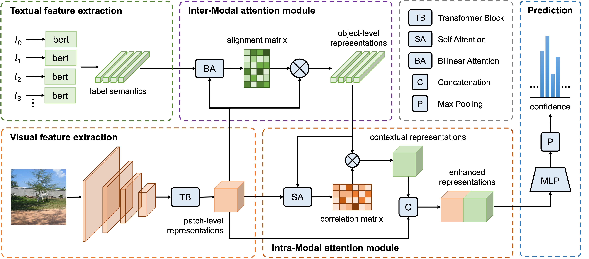

## Semantic-Guided Representation Enhancement for Multi-Label Classification

### Introduction
This is an official PyTorch implementation of Semantic-Guided Representation Enhancement for Multi-Label Image Classification [[paper]]().




### Data Preparation
1. Download dataset and organize them as follow:
```
|datasets
|---- MSCOCO
|-------- annotations
|-------- train2014
|-------- val2014
|---- NUS-WIDE
|-------- Flickr
|-------- Groundtruth
|-------- ImageList
|-------- NUS_WID_Tags
|-------- Concepts81.txt
|---- VOC2007
|-------- Annotations
|-------- ImageSets
|-------- JPEGImages
|-------- SegmentationClass
|-------- SegmentationObject
```

2. Preprocess using following commands:
```bash
python scripts/mscoco.py
python scripts/nuswide.py
python scripts/voc2007.py
python embedding.py --data [mscoco, nuswide, voc2007]
```

### Requirements
```
torch >= 1.9.0
torchvision >= 0.10.0
```

### Training
One can use following commands to train model and reproduce the results reported in paper.
```bash
python train.py --model mlic --arch resnet101 --data voc2007 --loss asl --batch-size 128 --lr 0.00009 --lamda 0.1 --ema-decay 0.9983 --pos
python train.py --model mlic --arch resnet101 --data mscoco --loss asl --batch-size 128 --lr 0.00009 --lamda 0.4 --pos
python train.py --model mlic --arch resnet101 --data nuswide --loss asl --batch-size 128 --lr 0.00009 --lamda 0.05 --pos
```
Note that the choice for `--model` can be `tresnet_l`, `tresnet_l21k`, `vit_large_patch16_224`, `vit_large_patch16_224_in21k` and `swin_large_patch4_window12_384_in22k`. One can use `CUDA_VISIBLE_DEVICES=0,1,2,3` before the training commands to enable distributed data parallel training with available GPUs.